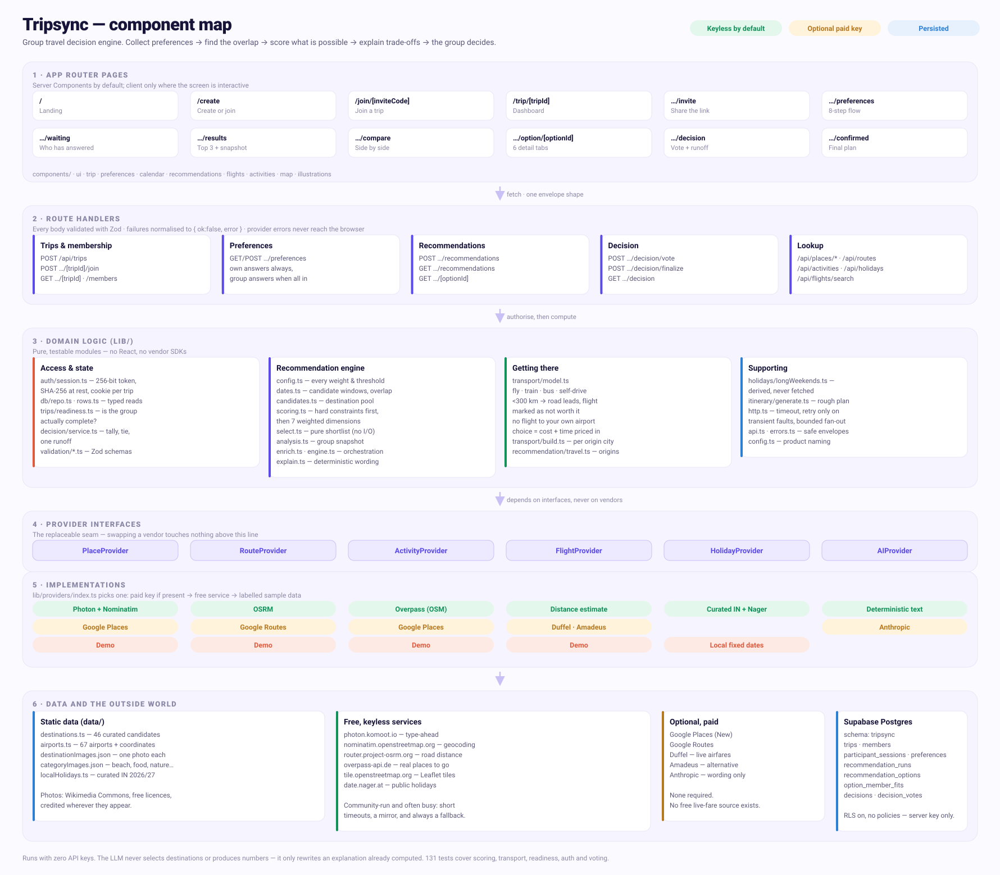

# Tripsync

**Different preferences. One trip.**

A group travel *decision* engine. Five friends with different budgets, schedules and
ideas of fun put their preferences in one place; the app finds where they overlap,
works out what is actually possible, explains the trade-offs and helps them commit to
one answer.

It is deliberately **not** a booking site. There are no payments, no hotel or flight
booking, and no group chat. The product ends where the decision ends.

```
Collect what everyone wants
  → understand where the group overlaps
    → find what is actually possible
      → explain the trade-offs
        → help the group decide
```

---

## Contents

1. [How it works](#how-it-works)
2. [Local setup](#local-setup)
3. [Supabase setup](#supabase-setup)
4. [Google Maps setup](#google-maps-setup)
5. [Flight API setup](#flight-api-setup)
6. [Holiday data](#holiday-data)
7. [Optional AI setup](#optional-ai-setup)
8. [Demo mode](#demo-mode)
9. [Environment variables](#environment-variables)
10. [Deploying to Vercel](#deploying-to-vercel)
11. [Architecture](#architecture)
12. [Testing](#testing)
13. [Known limitations](#known-limitations)

---

## How it works

**The journey.** One person creates a trip and shares a single invite link. Everyone
else joins with a name — no accounts, no passwords. Each person answers seven short
questions (scope, budget, dates, length, style, must-haves and deal-breakers, origin
city). Once everyone has submitted, the organiser generates the group's options.

**The engine is deterministic.** Recommendations are not produced by asking a language
model to pick destinations. For every (destination × date window) pair it:

1. **Checks hard constraints** — maximum budget, unavailable dates, explicit
   deal-breakers, trip length limits, domestic/international restrictions. A candidate
   is dropped only when more than half the group is blocked; otherwise the blocked
   member is shown as *not a fit* rather than the option being hidden.
2. **Scores each member** on seven weighted dimensions (budget 25, dates 20,
   destination preference 15, style 15, duration 10, travel time 10, other 5).
3. **Rolls up to a group score** that weights the *worst-off* member (25%) alongside
   the average (50%), hard-constraint satisfaction (15%) and consensus (10%). An option
   that is perfect for four people and impossible for one should not win.

Every weight lives in [`lib/recommendation/config.ts`](lib/recommendation/config.ts).

**External data comes second.** Only the top three shortlisted destinations trigger
paid API calls — flights, places and routes. That keeps a run bounded and cheap.

**AI comes last, and only for words.** If an Anthropic key is present, the model
rewrites an explanation that has *already been computed*. It is given structured facts,
told not to invent or change any number, and its output is validated with Zod. Anything
that fails validation falls back to deterministic text.

**Nothing hides disagreement.** The member-by-member breakdown is sorted worst-first.
If one person's budget is blown or their dates clash, their name is on the card.

---

## Local setup

Requires Node 20 or newer.

```bash
npm install
cp .env.example .env.local
npm run dev
```

The app runs at <http://localhost:3000>. With no credentials at all it runs in
[demo mode](#demo-mode) and the whole journey works end to end, except that a database
is still required for persistence.

### Seeding a full five-person trip

Filling in the flow five times to see the results page gets old. With the dev server
running:

```bash
# Creates a trip, adds five people, submits all preferences, generates options
node scripts/seedDemoTrip.mjs

# Or: you create the trip in the browser, the script adds the other four
node scripts/seedDemoTrip.mjs http://localhost:3000 --join <tripId> <inviteCode>

# Then, after you generate options in the browser, cast the other four votes
node scripts/seedDemoTrip.mjs http://localhost:3000 --vote <tripId>
```

Each simulated person gets their own cookie jar, so this exercises the real
participant-session model rather than writing to the database directly.

---

## Supabase setup

1. Create a Supabase project.
2. Run [`supabase/migrations/0001_init.sql`](supabase/migrations/0001_init.sql) in the
   SQL editor. It creates a dedicated **`tripsync` schema** so the app never
   collides with other projects in the same instance.
3. Expose the schema to the API: **Project Settings → API → Exposed schemas**, add
   `tripsync`.
4. Grant the service role access:

   ```sql
   grant usage on schema tripsync to service_role;
   grant all privileges on all tables in schema tripsync to service_role;
   grant all privileges on all sequences in schema tripsync to service_role;
   alter default privileges in schema tripsync grant all on tables to service_role;
   ```

5. Set `SUPABASE_URL` and `SUPABASE_SECRET_KEY` (the secret / service-role key).

**Security note.** Row Level Security is enabled on every table with *no policies*.
All access goes through the server using the secret key, which bypasses RLS. If the
publishable key ever leaks it can read nothing.

---

## Running with no API keys at all

**The app works fully without a single key.** By default it uses free, keyless
services that return real data:

| What | Free service used | Key needed |
| --- | --- | --- |
| City / destination search | [Photon](https://photon.komoot.io) + [Nominatim](https://nominatim.openstreetmap.org) | No |
| Road distance and time | [OSRM](https://router.project-osrm.org) | No |
| Things to do | [Overpass](https://overpass-api.de) (OpenStreetMap) | No |
| Maps | Leaflet + OpenStreetMap tiles | No |
| Public holidays | Curated Indian calendar + [Nager.Date](https://date.nager.at) | No |
| Destination photography | Wikimedia Commons | No |

Setting the Google keys swaps the first four for Google's equivalents, which are
faster and have richer place data — but nothing breaks without them.

**Flights are the one genuine gap.** There is no free source of live airfares;
every provider (Duffel, Amadeus, Kiwi) requires an account. Without a key the app
estimates fares from distance and labels them as estimates. It never presents a
modelled number as a live price.

These community services are run on donated capacity. They are rate-limited, and
Overpass in particular is often busy. Every call has a short timeout, a second
mirror where one exists, and a fallback, so a busy service costs you a section of a
page rather than the page.

## Google Maps setup

Two keys, because they have different exposure:

| Variable | Where it runs | Restrict to |
| --- | --- | --- |
| `NEXT_PUBLIC_GOOGLE_MAPS_BROWSER_KEY` | Browser | Maps JavaScript API, restricted by HTTP referrer |
| `GOOGLE_MAPS_SERVER_KEY` | Server only | Places API (New) + Routes API, restricted by IP if possible |

Enable **Maps JavaScript API**, **Places API (New)** and **Routes API** in Google Cloud.

The server key is never sent to the browser. Place photos are proxied through
`/api/places/photo` so the key stays server-side.

Without a browser key the map renders an honest empty state with the destination's
coordinates — there is deliberately no CSS-drawn fake map.

**Cost control:** field masks request only the fields used, autocomplete is debounced
at 320 ms, place details are fetched only when a suggestion is chosen, and responses
are cached (30 days for details, 7 days for activity searches).

---

## Getting there: road, rail and coach

Flying a short hop is a false economy — once check-in, security and airport
transfers are counted, a 200 km flight is neither cheaper nor faster than driving.
So every option is costed across **flight, train, bus and self-drive**.

- Under **300 km** by road (`ROAD_THRESHOLDS.roadFirstKm`), road options lead and a
  flight is marked "not worth it here".
- A destination served by the traveller's own airport gets no flight option at all.
- Beyond ~1,200 km surface travel stops being sensible and is marked as such.
- The suggested mode is whichever costs least once travelling time is priced in
  (`TRANSPORT_RATES.timeValuePerHour`), so a 5-hour flight can beat a 24-hour bus
  that costs half as much.

Each member says which modes they will use, and a mode nobody has ruled out is the
only kind we suggest. Rates and thresholds live in
[`lib/transport/model.ts`](lib/transport/model.ts).

Road, rail and coach costs are **planning estimates from distance**, not quoted
fares — there is no free API for Indian rail or coach pricing either. They are
labelled "est." everywhere they appear.

## Flight API setup

Default provider is **Duffel**:

```
DUFFEL_ACCESS_TOKEN=duffel_test_...
```

Searches run server-side only. For each shortlisted destination, member origins are
de-duplicated, capped at four, and run with a concurrency limit of three using
`Promise.allSettled` — one failing origin never loses the others.

An **Amadeus** adapter exists at
[`lib/providers/amadeusFlights.ts`](lib/providers/amadeusFlights.ts) and is used only
when `AMADEUS_CLIENT_ID`/`AMADEUS_CLIENT_SECRET` are set and Duffel is not. It is not
required, and Self-Service credentials are not assumed to work.

Live results are always labelled with the time they were checked. **Nothing is booked**
and a search result is never presented as a held seat.

---

## Holiday data

Long weekends are **derived, never fetched**: the app finds runs of consecutive
non-working days (weekends plus public holidays) and reports bridge days that would
join two breaks together.

Holidays resolve in this order:

1. **Curated national list** — India 2026 and 2027, transcribed from the DoPT gazetted
   holiday notifications. The free APIs do not cover India, which is this product's
   primary market.
2. **Live API** — [Nager.Date](https://date.nager.at) (`HOLIDAY_API_BASE_URL`), keyless.
3. **Fixed-date fallback** — national days only, and the UI says coverage is partial.

A holiday lookup failing never blocks date selection.

---

## Optional AI setup

```
ANTHROPIC_API_KEY=sk-ant-...
ANTHROPIC_MODEL=claude-sonnet-5
```

Used only to phrase explanations and trade-offs. Without a key, deterministic text is
used and the UI is otherwise identical. Cards written by the model carry an
*AI-written summary* badge.

---

## Demo mode

```
NEXT_PUBLIC_DEMO_MODE=true
```

Every provider has a demo implementation, so the whole product is demonstrable before
a single API credential exists. A provider is live only when demo mode is off **and**
its credentials are present; otherwise it degrades to sample data.

Demo data follows two rules:

- **It is always labelled.** Sample flight prices, sample suggestions and estimated
  travel times are badged in the UI. Nothing generated is presented as live.
- **It does not invent facts.** Flight prices are modelled from real airport
  coordinates. Activity suggestions are generic ("main beach day", "street food walk")
  rather than invented business names that someone might try to book.

---

## Environment variables

| Variable | Required | Notes |
| --- | --- | --- |
| `NEXT_PUBLIC_APP_NAME` | No | Product name; defaults to `Tripsync` |
| `NEXT_PUBLIC_DEMO_MODE` | No | `false` to use live providers |
| `SUPABASE_URL` | **Yes** | |
| `SUPABASE_SECRET_KEY` | **Yes** | Or `SUPABASE_SERVICE_ROLE_KEY`. Server only |
| `SUPABASE_DB_SCHEMA` | No | Defaults to `tripsync` |
| `NEXT_PUBLIC_GOOGLE_MAPS_BROWSER_KEY` | No | Maps JS SDK only |
| `GOOGLE_MAPS_SERVER_KEY` | No | Places + Routes. Server only |
| `DUFFEL_ACCESS_TOKEN` | No | Server only |
| `AMADEUS_CLIENT_ID` / `AMADEUS_CLIENT_SECRET` | No | Optional alternative |
| `HOLIDAY_API_BASE_URL` | No | Defaults to Nager.Date |
| `ANTHROPIC_API_KEY` / `ANTHROPIC_MODEL` | No | Server only |
| `NEXT_PUBLIC_SITE_URL` | No | For absolute invite links; Vercel is auto-detected |

Only `NEXT_PUBLIC_*` variables reach the browser. Every secret-bearing call is made
from a Route Handler or Server Component, guarded by the `server-only` package.

---

## Deploying to Vercel

1. Push the repository to GitHub and import it in Vercel.
2. Add the environment variables above in **Project Settings → Environment Variables**.
3. Deploy. No `vercel.json` is needed.

The recommendation route sets `maxDuration = 60` because a run makes several external
calls. Everything is serverless-safe: no local filesystem persistence, no long-running
processes, no in-memory source of truth. Recommendation runs are persisted, so results
pages never re-trigger the external API layer.

```bash
npm run lint       # eslint
npm run typecheck  # tsc --noEmit
npm run test       # vitest
npm run build      # next build
```

---

## Architecture



Regenerate the diagram after a structural change:

```bash
npm run diagram:svg   # rebuild docs/component-map.svg from scripts/buildDiagram.mjs
npm run diagram       # rasterise it to docs/component-map.png
```

```
app/
  page.tsx                        Landing
  create/                         Create or join
  join/[inviteCode]/              Join flow
  trip/[tripId]/
    layout.tsx                    Membership gate for everything below
    page.tsx                      Dashboard
    invite/ preferences/ waiting/
    results/ compare/ decision/ confirmed/
    option/[optionId]/            Tabbed detail: overview, itinerary,
                                  flights, activities, map, who it works for
  api/                            Route Handlers (Zod-validated)

lib/
  auth/session.ts                 Opaque participant tokens
  db/                             Typed Supabase client + repository
  providers/                      One module per vendor, behind interfaces
    demo/                         A demo implementation of every provider
  recommendation/
    config.ts                     All weights and thresholds
    dates.ts                      Candidate windows, overlap analysis
    scoring.ts                    Hard constraints + individual scoring
    select.ts                     Pure shortlist selection (no I/O)
    enrich.ts                     Bounded external lookups
    engine.ts                     Orchestration + persistence
  holidays/longWeekends.ts        Derived long weekends
  itinerary/generate.ts           Deterministic day planner

data/destinations.ts              46 curated candidates
supabase/migrations/              Schema, indexes, constraints, RLS
```

**Provider abstraction.** No React component calls a vendor. Everything goes through
`PlaceProvider`, `RouteProvider`, `FlightProvider`, `ActivityProvider`, `HolidayProvider`
and `AIProvider`, so a vendor can be swapped without touching the product.

**Security model.** On create or join, a 256-bit random token is generated, its SHA-256
hash stored, and the raw value set in an `httpOnly`, `SameSite=Lax`, `Secure` cookie —
scoped per trip, so one trip's token cannot be replayed against another. Tokens never
appear in URLs or logs. Every trip-scoped request resolves the cookie to a membership
before reading anything.

---

## Testing

```bash
npm run test
```

102 tests covering budget and date validation, long-weekend detection (against the real
2026 Indian holiday calendar), group consensus, individual scoring, deal-breaker
elimination, top-3 selection, flight normalisation, third-party failure handling,
itinerary generation, participant authorisation (including cross-trip token replay) and
the voting/runoff logic.

Scoring tests assert *behaviour* — that a beach-leaning group gets a beach option, that
the worst-off member is protected — rather than hard-coding a winning destination.

---

## Imagery and licensing

The interface uses two kinds of artwork:

- **Illustrations** (`components/illustrations/scenes.tsx`) are hand-authored SVG.
  They theme with the palette, scale cleanly and cost nothing to load.
- **Destination photography** is sourced from Wikimedia Commons under free licences,
  curated one image per destination by `scripts/curateImages.mjs` and stored in
  `data/destinationImages.json`.
- **Activity photography** follows one rule: show a picture of what is being talked
  about. A named place uses its own photo where a provider supplies one; otherwise
  the card shows a photo of that *kind* of place, so a beach idea shows a beach and a
  street-food idea shows street food. Those nine category images
  (`data/categoryImages.json`) were each chosen by eye — filename matching alone
  produced a scanned nursery catalogue for "beach".

Commons licences require credit. Attribution travels with the image in the catalog
and is rendered by `DestinationPhotoCredit` on the destination detail and
confirmation pages. **If you replace or add images, keep the credit line**, or swap
in photography you own outright.

Re-running the curation script is safe: it resumes from what is already stored and
only fetches what is missing.

```bash
node scripts/curateImages.mjs             # fill in anything missing
node scripts/curateImages.mjs goa bali    # redo specific destinations
```

Where a destination has no photograph, the UI falls back to generated SVG artwork
rather than showing a broken or empty card.

## Known limitations

- **On-ground costs are planning estimates.** Each destination carries an indicative
  daily spend used by the budget model. It is labelled as an estimate everywhere it
  appears, and is not a quote. A live pricing provider would replace it.
- **Deal-breakers are only enforced when they can be checked.** "No international
  travel" and "no long travel" are evaluated against real data. "No shared rooms" or
  "no extreme heat" cannot be, so they are surfaced to the group as booking notes
  rather than being silently ignored or guessed at.
- **The destination catalog is curated, not live.** 46 hand-written candidates, in one
  file, intended to be replaced by a discovery API.
- **No seasonality model.** The engine does not know that Goa in May is unpleasant.
  Weather data would be the single highest-value addition.
- **Recommendations require 100% completion** and are regenerated manually. There is no
  automatic refresh when someone edits an answer after a run.
- **Lunar holiday dates can shift** by a day on moon sighting. The UI says to confirm
  before booking.
- **One runoff only.** If a group ties twice, the app stops and tells them to talk.
- **Destination photography is generic to the place, not to the trip.** It shows a
  well-known view, not the specific area a group would stay in.
- **Transport costs below flights are modelled, not quoted.** There is no free API
  for Indian rail or coach fares, so train and bus prices come from a per-kilometre
  model. Treat them as a planning guide.
- **OpenStreetMap coverage varies.** Activity results are excellent in well-mapped
  places and thin in others, and Overpass is frequently too busy to answer at all.
